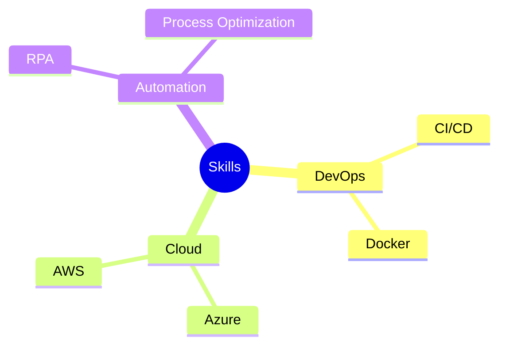

<!-- Clean, Modern Header -->
<div align="center">
  
</div>

<br />

<div align="center">
  [](https://git.io/typing-svg)
</div>

<br />
<br />

<!-- Social Links -->
<div align="center">
  <a href="https://www.linkedin.com/in/ali-amrani-566361349/">
    
  </a>
  &nbsp;&nbsp;
  <a href="mailto:ali.amrani.dev@gmail.com">
    
  </a>
  &nbsp;&nbsp;
  <a href="https://github.com/amrani350">
    
  </a>
  &nbsp;&nbsp;
  <a href="https://github.com/amrani350/portfolio">
    
  </a>
</div>

<br />
<br />
<br />

<!-- About Me Section -->
<h2 align="center">👨‍💻 About Me</h2>

<br />

<div align="center">
  

  <div align="left" style="width: 50%;">
    ```typescript
    const ali = {
      name: "Ali Amrani",
      location: "🌍 Morocco, Tangier",
      current: "👨‍💻 Student & IT Intern @ TE Connectivity",
      education: "🎓 Master's in Computer & Network Engineering",
      learning: ["Angular", "ASP.NET Web API", "DevOps"],
      passions: ["Process Automation", "Full-Stack Development"]
    };
    ```
  </div>
</div>

<br />
<br />
<br />
<br />

<!-- Experience Section -->
<h2 align="center">💼 Professional Experience</h2>

<br />

<div align="center">
  <div style="max-width: 800px; margin: 0 auto; text-align: left;">
    <div style="display: flex; align-items: center; margin-bottom: 20px;">
      
      <h3>IT Intern – Digital Process Automation @ TE Connectivity</h3>
    </div>

    <p><em>Apr 2025 – Present | Tanger–Tétouan–Al Hoceima, Morocco</em></p>
    <ul>
      <li>🔧 Working on automating internal processes</li>
      <li>🛠️ Tech Stack: Angular, ASP.NET Web API, Modern JavaScript</li>
    </ul>
  </div>
</div>

<br />
<br />

<div align="center">
  <div style="max-width: 800px; margin: 0 auto; text-align: left;">
    <div style="display: flex; align-items: center; margin-bottom: 20px;">
      
      <h3>Full‑Stack Developer (Intern) @ PREMIUM ADVICE & TRAINING</h3>
    </div>

    <p><em>Jul 2024 – Sep 2024 | Tanger, Morocco</em></p>
    <ul>
      <li>🚀 Built full-stack learning platform</li>
      <li>💻 Developed course tracking & admin systems</li>
    </ul>
  </div>
</div>

<br />
<br />

<div align="center">
  <div style="max-width: 800px; margin: 0 auto; text-align: left;">
    <div style="display: flex; align-items: center; margin-bottom: 20px;">
      
      <h3>RPA Developer (Intern) @ BMCI Groupe BNP Paribas</h3>
    </div>

    <p><em>Jul 2023 – Aug 2023 | Casablanca, Morocco</em></p>
    <ul>
      <li>🤖 Built automated transaction-monitoring systems</li>
      <li>🔄 Utilized Blue Prism and C#</li>
    </ul>
  </div>
</div>

<br />
<br />
<br />

<!-- Education Section -->
<h2 align="center">🎓 Education</h2>

<br />

<div align="center">
  <div style="max-width: 800px; margin: 0 auto; text-align: left;">
    <div style="display: flex; align-items: center; margin-bottom: 20px;">
      
      <h3>École Marocaine des Sciences de l'Ingénieur</h3>
    </div>

    <p><em>Master's in Computer & Network Engineering (2020 – 2025)</em></p>
    <ul>
      <li>🎓 Focus on software engineering and network infrastructure</li>
      <li>🏆 Top of class in programming and systems design</li>
    </ul>
  </div>
</div>

<br />
<br />
<br />

<!-- Tech Stack Section -->
<h2 align="center">🛠️ Tech Stack</h2>

<br />

<div align="center" style="display: flex; flex-wrap: wrap; justify-content: center; gap: 15px; margin: 0 auto; max-width: 700px;">
  
  
  
  
</div>

<br />

<div align="center" style="display: flex; flex-wrap: wrap; justify-content: center; gap: 15px; margin: 0 auto; max-width: 700px;">
  
  
  
  
</div>

<br />
<br />
<br />

<!-- Projects Section -->
<h2 align="center">🚀 Featured Projects</h2>

<br />

<div align="center" style="display: flex; justify-content: center; gap: 20px; flex-wrap: wrap;">
  <a href="https://www.premiumadvicetrainingacademy.com">
    
  </a>
  
  <a href="https://github.com/amrani350/portfolio">
    
  </a>
</div>

<br />
<br />
<br />

<!-- GitHub Stats Section -->
<h2 align="center">📊 GitHub Stats</h2>

<br />

<div align="center">
  
</div>

<br />
<br />

<div align="center">
  
</div>

<br />
<br />
<br />

<!-- Current Focus Section -->
<h2 align="center">🎯 Current Focus</h2>

<br />

<div align="center">
  

  
</div>

<br />
<br />
<br />

<!-- Footer -->
<div align="center">
  
  <br /><br />
  
</div>


